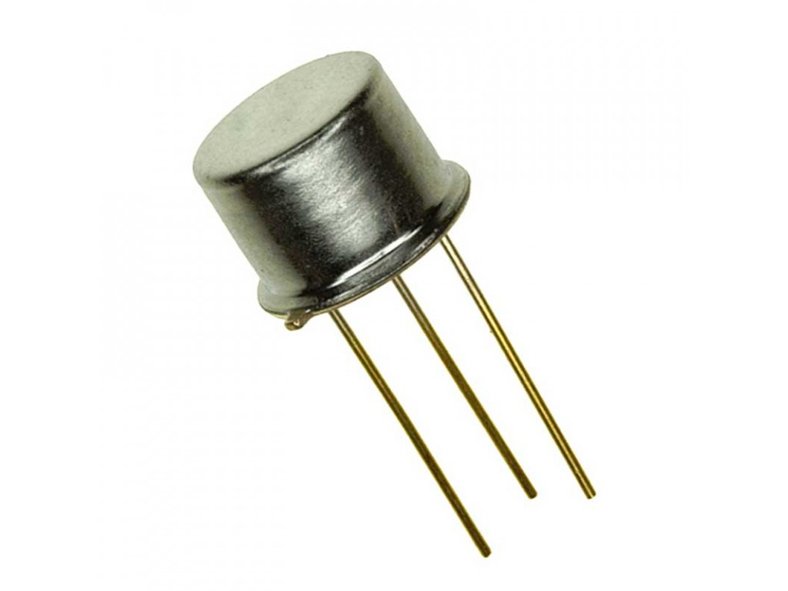

---
@snap[midpoint span-100]
## Tema 2
## Representación de Información
@snapend

---
@snap[midpoint span-100 text-left]
### Representación de Información
Para transmitir información escrita, los humanos utilizamos un alfabeto, o un conjunto de símbolos. Cada símbolo es denominado un @css[imp123](caracter).
 
Cada caracter tiene algun significado: sonidos, pausas, numeros, sentimientos.
@snapend

+++?include=assets/CARACTERES.md

---
Todas las instrucciones o interacciones con computadores se pueden @css[imp123](interpretar) a través de caraceters.

Los caracteres, internamente, están formados por @css[imp123](bits).

+++
## Bits 
### Binary DigIT

Un bit es la unidad más básica de información en el mundo digital. Un bit puede representar dos valores: 0 ó 1.

Estos valores se pueden interpetar también como `TRUE` o `FALSE`, o los estados @css[imp123](encendido) o @css[imp123](apagado).

Para una circuito es fácil representarlo: +3.5 volts ó 0 volts.

+++
@snap[west fragment]
@fa[lightbulb imp123 fa-10x]
@snapend

@snap[east fragment]
@fa[lightbulb fa-10x]
@snapend

+++
#### ¿Por qué utilizamos bits?
@box[span-90 fragment bg-orange text-white text-left](#Es más facil trabajar con 2 rangos de valores que con 3,4,5[...]. )
@box[span-90 fragment bg-white text-blue](#Los transistores manejan dos estados: encendidos y apagadados.)
@box[span-90 fragment bg-green text-white](#El almacenamiento y procesamiento en binario es muy confiable.)

+++
#### Transistor
@snap[midpoint span-80]

@snapend

+++

+++
@snap[h4-white west span-40]
#### Almacenamiento de información
Ejemplo: 
@ul[text-08]
* De 0 hasta 1.75 = @css[imp123](0)
* De 1.76 hasta 3.5 = @css[imp123](1)
@ulend
@snapend

@snap[north-east span-60 fragment]
@table[text-mid](assets/data/HDD_data_1.csv)
@snapend

@snap[east span-60]
@table[table-fragment](assets/data/HDD_data_2.csv)
@snapend

---?include=assets/BYTES.md

---?include=assets/SISTEMAS_NUMERACION.md